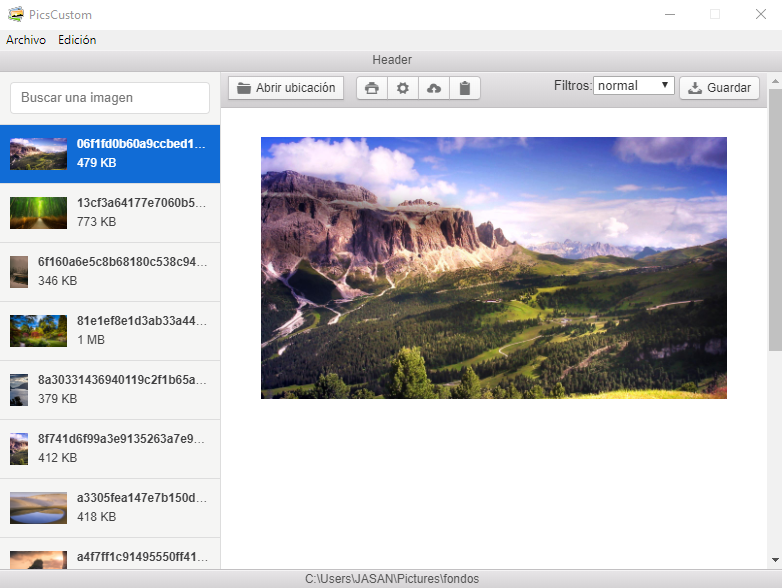

# Aplicación de Imagenes Personalizadas

**Aplicativo Desktop** para visualizar imagenes, aplicarles filtro, editarlas, imprimirlas, guardarlas y subirlas a la nube.

## ¿Cómo funciona?

Requiere Node.JS 10 en adelante

- `npm install` para instalar las dependencias.
- `npm run dev` para el entorno de desarrollo.
- `npm run start` para el entorno de producción.
- `npm run package-mac`para crear ejecutable de Mac
- `npm run package-win`para crear ejecutable de Windows
- `npm run package-linux`para crear ejecutable de Linux

## Licencia

MIT
